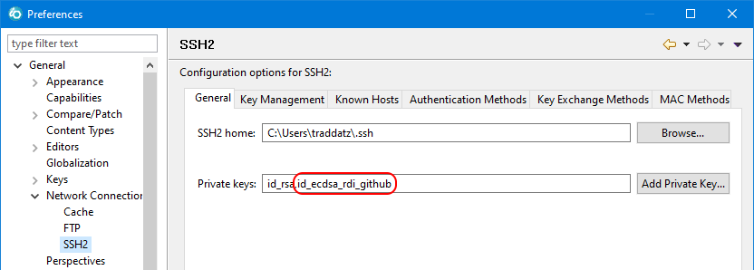
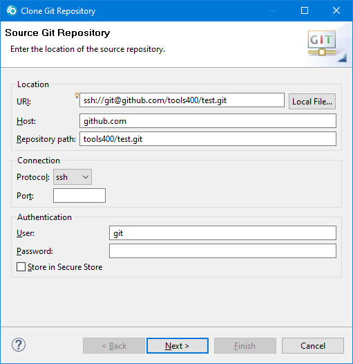

# test-ssh

This project is used as a playground for testing ssh connections between GitHub and IBM's development IDEs for RPG.

## Testing RDi 9.5.1.3

* eGit Plug-in
  The eGit plug-in must be installed with the IBM Installation Manager.
  The following repositories must be connected:

  * RDi 9.5.0.0

  * RDi 9.5.1.0

  Now install component: *Eclipse Git Team Provider*

* SSH2 Configuration

  

* Git System Settings

  ```properties
  [diff "astextplain"]
    textconv = astextplain
  [filter "lfs"]
    clean = git-lfs clean -- %f
    smudge = git-lfs smudge -- %f
    process = git-lfs filter-process
    required = true
  [http]
    sslBackend = openssl
    sslCAInfo = C:/Program Files/Git/mingw64/ssl/certs/ca-bundle.crt
  [core]
    autocrlf = true
    symlinks = false
    fscache = true
    longpaths = true
  [pull]
    rebase = false
  [init]
    defaultBranch = master
  ```

* Git User Settings

  ```properties
  [core]
    autocrlf = true
    editor = \"C:\\Users\\traddatz\\AppData\\Local\\Programs\\Microsoft VS Code\\Code.exe\" --wait
  [http]
    sslVerify = true
  [user]
    name = Thomas Raddatz
    email = thomas.raddatz@tools400.de
  [rdi]
    version = 9.5.13
  ```

## Cloning a Repository



### Test Results SSH

| Connection | Clone | Push  | Pull  | Comment                                                           |
| :---       | :---: | :---: | :---: | :---                                                              |
| ssh        |   X   |   X   |   X   | SSH key must be generated with: ssh-keygen -t ecdsa -b 256 -m PEM |
